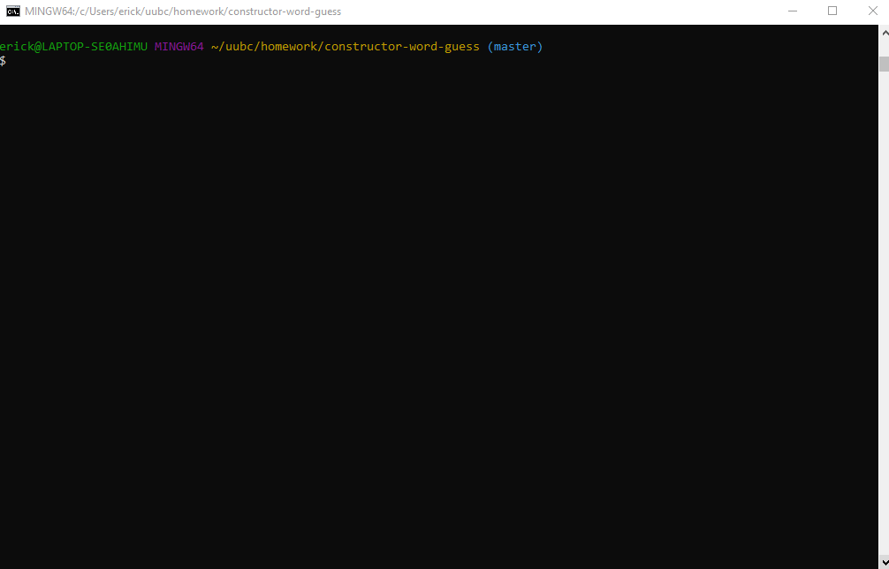
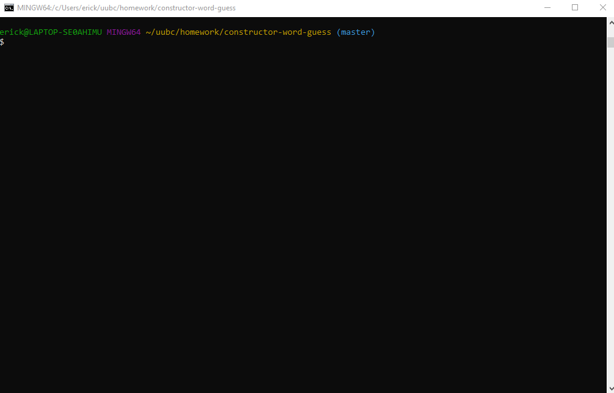

# constructor-word-guess
## A word guess game that works with node.js

* This is a simple hangman-style game that uses the inquirer and prompt npm packages
* You must have these packages installed for this to work
* The rules are simple: keep guessing letters until you guess them all correct. You have 25 tries total!
* Have fun!

## Example of a winning game

## Example of a losing game

